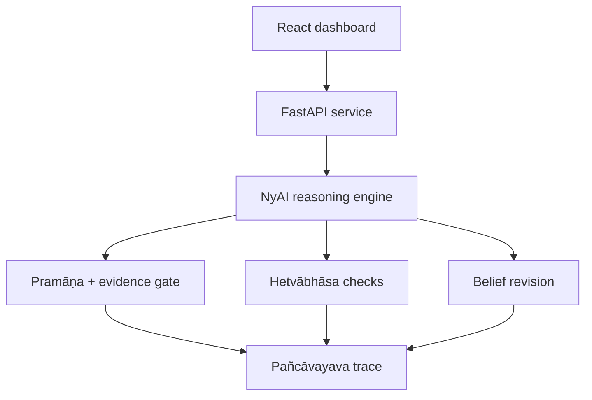

<div align="center">

# NyAI

### A Nyāya-grounded reasoning workbench for evidence-aware AI

Built for **Unriddling Inference 2026 · IIT Delhi**

[](https://www.python.org/)
[](https://fastapi.tiangolo.com/)
[](https://react.dev/)
[](https://github.com/NeoRishi/nyai-dashboard/actions/workflows/ci.yml)

[Why NyAI?](#why-nyai) · [How it works](#how-it-works) · [Run locally](#run-locally) · [API](#api-reference)

</div>

## Why NyAI?

Most AI demos show a conclusion. NyAI is a rule-based research prototype that makes the path to that conclusion inspectable: what evidence was used, how trustworthy each source was considered, whether the reasoning contains a fallacy, and when a belief should be revised or suspended.

The project translates selected concepts from the classical Indian **Nyāya** tradition into an interactive comparison between two agents:

- **NyAI agent** — tracks evidence provenance, applies a pramāṇa gate, detects fallacies, revises beliefs and produces a five-part reasoning trace.
- **Naive baseline** — accepts a claim whenever evidence exists, without evaluating source quality or conflicts.

## What the prototype demonstrates

| Capability | Nyāya concept | Implementation |
|---|---|---|
| Evidence provenance | **Pramāṇa** | Classifies direct perception, inference, testimony and analogy |
| Quality gate | Multiple pramāṇas | Requires source diversity plus at least one strong source |
| Fallacy checks | **Hetvābhāsa** | Flags overgeneralization, contradiction, unsupported claims and related failure modes |
| Belief revision | Evidence hierarchy | Revises, suspends or retains a belief when conflicting evidence arrives |
| Explainable trace | **Pañcāvayava** | Formats each decision as a five-part syllogistic explanation |
| Honest uncertainty | Conflicting evidence | Returns an uncertain or suspended verdict instead of forcing acceptance |

Five built-in scenarios exercise the engine across wellness and general reasoning: an agreement case, stale evidence, a counter-example, stronger contradictory evidence and conflicting studies.

## How it works



```text
frontend/
  src/App.jsx                 Interactive dashboard and scenario views
backend/
  main.py                     FastAPI routes and production static serving
  nyai/
    pramana.py                Evidence types and source-strength model
    belief.py                 Belief store and revision rules
    hetvabhasa.py             Fallacy detectors
    pancavayava.py            Five-part explanation generator
    reasoning_agent.py        NyAI and naive baseline agents
    scenarios.py              Five demonstration scenarios
  static/                     Production frontend bundle
```

## Run locally

### Prerequisites

- Python 3.11+
- Node.js 18+

### Production-style quick start

```bash
python -m venv .venv
source .venv/bin/activate          # Windows: .venv\Scripts\activate
python -m pip install -r backend/requirements.txt

cd frontend
npm ci
npm run build

cd ../backend
uvicorn main:app --reload --port 8000
```

Open [http://localhost:8000](http://localhost:8000). Interactive API documentation is available at [http://localhost:8000/docs](http://localhost:8000/docs).

For frontend development, run `npm run dev` inside `frontend/` in a second terminal. Vite proxies `/api` requests to the backend on port 8000.

### Run the smoke tests

```bash
python -m unittest discover -s backend/tests -v
```

## API reference

| Method | Path | Purpose |
|---|---|---|
| `GET` | `/api/health` | Service health check |
| `GET` | `/api/scenarios` | List the five built-in scenarios |
| `GET` | `/api/scenarios/{id}` | Run one scenario (`s1`–`s5`) |
| `GET` | `/api/scenarios/all/compare` | Compare both agents across every scenario |
| `POST` | `/api/evaluate` | Evaluate a custom claim and its evidence |
| `POST` | `/api/revise` | Apply new evidence to an existing belief |
| `GET` | `/api/pramana-types` | List supported evidence-source types and weights |

## Deploy with Railway

The repository includes a `Dockerfile` and `railway.toml`. Create a Railway project from this GitHub repository; the health check is configured for `/api/health`, and the container respects Railway's injected `PORT` value.

## Scope and responsible use

NyAI is an educational hackathon prototype, not a trained foundation model, a clinical system or a substitute for expert judgment. Its source weights, fallacy checks and scenario rules are deterministic design choices intended to make an epistemic architecture discussable and testable. The wellness scenarios are illustrative and must not be treated as medical advice.

## Author and acknowledgment

Designed and built by **Hrishikesh (NeoRishi)** · EPBA-14, IIM Calcutta.

The implementation was developed with AI assistance from Claude by Anthropic. The philosophical framing, domain model and system design are the author's original work.
